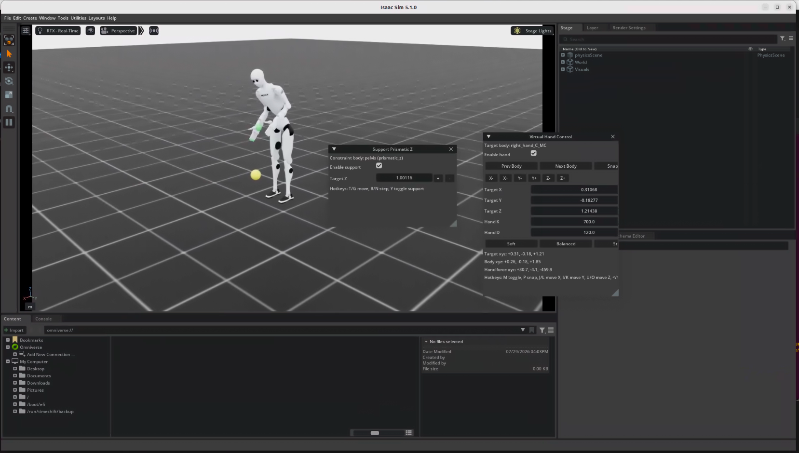
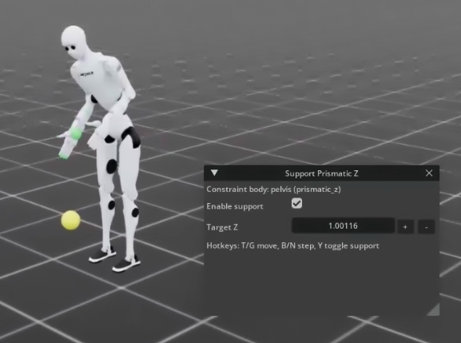
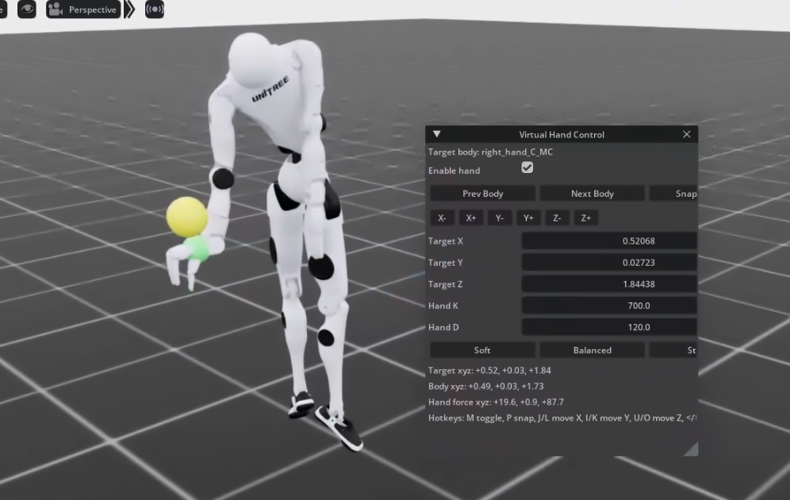
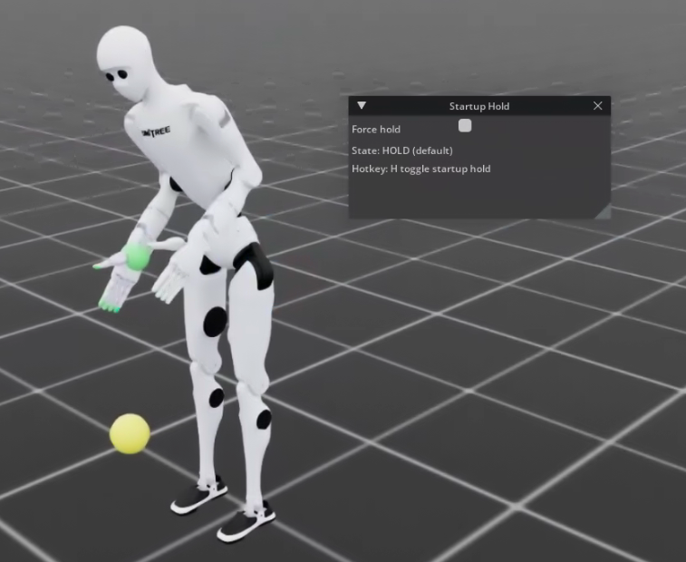

# Unitree SDK2 Bridge (Isaac Lab / Isaac Sim)



Bridge Unitree SDK2 (DDS) low-level topics into an Isaac Lab robot simulation. This allows you to control the simulated robot via `rt/lowcmd`, and publish state topics such as `rt/lowstate`.

- Reference implementation: [unitree_sdk2py_bridge.py](https://github.com/unitreerobotics/unitree_mujoco/blob/main/simulate_python/unitree_sdk2py_bridge.py)

# Dependencies

- [Isaac Lab](https://github.com/isaac-sim/IsaacLab)
- [Unitree SDK2 Python](https://github.com/unitreerobotics/unitree_sdk2_python)
- [Unitree RL Lab](https://github.com/unitreerobotics/unitree_rl_lab)

## Topics and Data Flow

**Subscribe**

- `rt/lowcmd`

**Publish**

- `rt/lowstate`
- `rt/sportmodestate`
- `rt/wirelesscontroller`

**Control notes**

- Unitree `LowCmd` contains a 5-tuple: `q/dq/kp/kd/tau`.

## Quick Start

### 1) Start the bridge in Isaac Sim / Isaac Lab

Using H2 as an example:

```bash
python /media/unitree/HDDStorage/brigham/IsaacLab/scripts/demos/unitree_sdk2_bridge.py \
  --h2-usd /path/to/h2/usd \
  --robot h2 \
  --interface lo \
  --physics-dt 0.001 \
  --support-preset full_hoist \
  --startup-hold-mode asset
```

Notes:

- If you do not pass `--support-preset` / `--support-constraint` / `--enable-hoist` / `--enable-virtual-hand`, no “hoist/support/virtual hand” features are enabled by default. The bridge only performs DDS ↔ simulation joint bridging.
- `--support-preset full_hoist` is currently equivalent to “adding a `prismatic_z` world constraint on pelvis”, which helps prevent falling and lifts the robot. The corresponding GUI window is `Support Prismatic Z`.

### 2) External controller script

- `domain_id=0` (default)
- Publish DDS `LowCmd` to `rt/lowcmd` to control the simulated robot.

## Support / Hoist / Virtual Hand (Recommended)

These three features have different goals:

- **Support Constraint (Recommended):** Use a physics joint to constrain a robot link rigid body to the world frame. Similar to a real-world hoist/support.
- **Hoist (Experimental):** Simulate a “rope” via external forces / hard constraint.
- **Virtual Hand (Experimental):** Apply external forces to a body, useful for interactive tests (lifting/supporting).

### Support Constraint



```bash
python /media/unitree/HDDStorage/brigham/IsaacLab/scripts/demos/unitree_sdk2_bridge.py \
  --robot h2 \
  --interface lo \
  --support-constraint prismatic_z \
  --support-constraint-body pelvis
```

GUI / hotkeys (window: `Support Prismatic Z`):

- `Target Z`: target support height (increase/decrease this to raise/lower the whole robot)
- `Enable support`: enable/disable support
- `Y`: toggle support
- `T/G`: continuously increase/decrease `Target Z`
- `B/N`: step increase/decrease `Target Z`

### Virtual Hand (Experimental)



Enable the tool at startup (then toggle forces via hotkeys):

```bash
python /media/unitree/HDDStorage/brigham/IsaacLab/scripts/demos/unitree_sdk2_bridge.py \
  --robot h2 \
  --interface lo \
  --support-preset full_hoist \
  --enable-virtual-hand
```

GUI / hotkeys (window: `Virtual Hand Control`):

- `M`: toggle virtual hand force
- `P`: snap target point to current body position
- `J/L`: move target point in world X
- `I/K`: move target point in world Y
- `U/O`: move target point in world Z
- `</>`: switch target body

### Hoist (Experimental; not recommended as a long-term support)

Use only when you explicitly want to test “external-force hoisting”:

```bash
python unitree_sdk2_bridge.py \
  --robot h2 \
  --interface lo \
  --enable-hoist \
  --hoist-model elastic
```

Notes:

- `--hoist-model hard` forcibly moves the root pose and can look “non-physical”. Recommended only for short debugging sessions.
- The `wrist_test` preset automatically enables `elastic` hoist (light preload), but stability/realism still depends on the scene and parameters.

## Key Arguments

### DDS and Simulation

- `--domain-id`: Cyclone DDS domain id.
- `--interface`: DDS network interface name. For debugging, `lo` is recommended to avoid mixing with real robots or other processes.
- `--physics-dt`: physics timestep.
- `--device`: `cpu` or `cuda:*`. If VRAM is tight or GPU is shared, `--device cpu` is recommended.

### kp/kd passthrough mode (Important)

- `--use-lowcmd-kp-kd`
  - **Default (not set):** ignore `kp/kd` from lowcmd; only use `q/dq/tau`:
    - `q` → position target
    - `dq` → velocity target
    - `tau` → effort target (feed-forward torque)
    - `kp/kd` → provided by simulation-side implicit actuator stiffness/damping
  - **If enabled:** use lowcmd `kp/kd` and compute explicitly inside the bridge:
    - `tau + kp*(q_des-q) + kd*(dq_des-dq)`

This switch trades off between “simulation stability” and “matching real-robot lowcmd behavior”.

### Startup hold (standing lock)



- `--hold-default-pose / --no-hold-default-pose`: whether to hold a pose before receiving lowcmd.
- `--startup-hold-mode`
  - `asset`: use asset-provided `default_joint_stiffness/damping` for a light hold
  - `lock_current`: lock the pose at startup (using the kp/kd below)
- `--startup-hold-kp / --startup-hold-kd / --startup-hold-max-tau`: startup hold parameters.

### Velocity source

- `--velocity-source sim|fd`
  - `sim`: use PhysX joint velocity `joint_vel`
  - `fd`: use finite difference `(q[t]-q[t-1])/dt`
- `--velocity-fd-lpf-alpha`: first-order IIR smoothing for fd velocity (0 disables)
- `--velocity-fd-max-abs`: fd velocity clamp (0 disables)

Notes:

- When `--use-lowcmd-kp-kd` is enabled, the velocity source directly affects D-term stability.
- In the default (kp/kd filtered) mode, the velocity source is mainly for diagnostics and startup hold.

### Support / Hoist / Virtual Hand

- `--support-preset`: `none|light_support|full_hoist|wrist_test`
- `--support-constraint`: `none|fixed|prismatic_z` (world constraint for pelvis etc.)
- `--enable-hoist`: Hoist tool (experimental; off by default)
- `--enable-virtual-hand`: Virtual Hand tool (experimental; off by default)

## Debugging and Diagnostics

### Print low-level control diagnostics

```bash
--debug-lowcmd-interval-steps 200
--debug-lowcmd-topk 8
--debug-lowcmd-joints "21"
```

Diagnostics include:

- `lowcmd_rate`, `lowcmd_age`
- `max|q_err|`, `max|dq_err|`
- `max|dq_sim|` (raw PhysX velocity), `max|dq_used|` (velocity used by controller)
- top-k joints with the largest torques

### Topic source mismatch check (strongly recommended)

The bridge writes `--mode-machine` to `LowState.mode_machine`. If the external script reads a `mode_machine` different from the expected value, your DDS topic source is wrong (you are reading from a real robot or another process).

## FAQ

### 1) VRAM explosion on startup / PhysX scene creation failed

This can happen when multiple users share a GPU or VRAM is tight:

- `CUDA error: out of memory`
- `Unable to allocate ... mGpuContactPairsDev`

Suggestions:

- Use CPU physics: `--device cpu`
- Or run without rendering: `--headless`

### 2) Violent shaking as soon as lowcmd is received

Common causes:

- `kp/kd` (especially the D term) is sensitive to velocity noise/outliers
- `dq` source is unreliable (e.g., clamped to a fixed limit or has spikes)

Recommended debugging order:

- First validate stability with the default mode (without `--use-lowcmd-kp-kd`)
- If you must match real lowcmd behavior: enable `--use-lowcmd-kp-kd`, and observe `dq_sim/dq_used` with `--debug-lowcmd-interval-steps`

## Version Notes and Constraints

- This script targets “bridging the same DDS topics as the real robot”, but simulation actuators, contacts, and velocity estimation differ from real hardware. Strong kp/kd is more likely to trigger numerical instability in simulation.
- Build a stable baseline in “kp/kd filtered” mode first, then gradually enable Unitree-style kp/kd passthrough and more realistic motor/saturation models.

# Argument Reference

## Bridge arguments (unitree_sdk2_bridge.py)

| Argument                                           | Description                                                                 | Required (default if omitted)                                                                 |
| -------------------------------------------------- | --------------------------------------------------------------------------- | ---------------------------------------------------------------------------------------------- |
| `--robot`                                          | Select robot model                                                         | No (default: `h2`)                                                                             |
| `--domain-id`                                      | Cyclone DDS domain id                                                      | No (default: `0`)                                                                              |
| `--interface`                                      | DDS network interface (passed to `ChannelFactoryInitialize`)                | No (default: empty string `""`; usually pass `lo` or an actual NIC explicitly)                |
| `--physics-dt`                                     | Physics timestep                                                           | No (default: `0.002`)                                                                          |
| `--render-interval`                                | Render every N physics steps (larger = smoother GUI / relatively “faster”)  | No (default: `4`)                                                                              |
| `--mode-machine`                                   | Written to `LowState.mode_machine` for source tagging / mismatch detection  | No (default: `7`)                                                                              |
| `--velocity-source`                                | Velocity used by controller: `sim`=PhysX `joint_vel`; `fd`=finite difference | No (default: `sim`)                                                                            |
| `--velocity-fd-lpf-alpha`                          | First-order IIR smoothing for fd velocity (0 disables)                      | No (default: `0.0`)                                                                            |
| `--velocity-fd-max-abs`                            | fd velocity clamp in rad/s (0 disables)                                     | No (default: `0.0`)                                                                            |
| `--physx-enable-external-forces-every-iteration`   | Apply external forces in every TGS position iteration to reduce velocity noise | No (default: `False`; provided means enabled)                                                |
| `--physx-min-velocity-iterations`                  | Minimum PhysX solver velocity iterations (improves velocity accuracy)       | No (default: `0`)                                                                              |
| `--support-preset`                                 | Support preset: `none/light_support/full_hoist/wrist_test`                  | No (default: `none`); to enable default hoist, `full_hoist` is recommended                    |
| `--support-constraint`                             | World constraint type: `none/fixed/prismatic_z`                             | No (default: `none`)                                                                           |
| `--support-constraint-body`                        | Rigid body name to attach the support constraint                            | No (default: `pelvis`)                                                                         |
| `--support-prismatic-lower`                        | Lower limit for prismatic_z support (m)                                     | No (default: `-10.0`)                                                                          |
| `--support-prismatic-upper`                        | Upper limit for prismatic_z support (m)                                     | No (default: `10.0`)                                                                           |
| `--support-prismatic-drive-stiffness`              | prismatic_z drive stiffness                                                 | No (default: `8000.0`)                                                                         |
| `--support-prismatic-drive-damping`                | prismatic_z drive damping                                                   | No (default: `1200.0`)                                                                         |
| `--support-prismatic-drive-max-force`              | prismatic_z drive max force                                                 | No (default: `200000.0` i.e. `2e5`)                                                            |
| `--hold-default-pose`                              | Hold a pose before receiving lowcmd (light hold)                             | No (default: `True`; with or without this flag it is True, mainly for being explicit)         |
| `--startup-hold-mode`                              | Startup hold mode: `asset` or `lock_current`                                | No (default: `asset`)                                                                          |
| `--startup-hold-kp`                                | Startup hold P gain                                                         | No (default: `120.0`)                                                                          |
| `--startup-hold-kd`                                | Startup hold D gain                                                         | No (default: `6.0`)                                                                            |
| `--startup-hold-max-tau`                           | Startup hold torque clamp                                                   | No (default: `120.0`)                                                                          |
| `--status-interval-steps`                          | Print basic status every N steps (0 disables)                                | No (default: `1000`)                                                                           |
| `--debug-lowcmd-interval-steps`                    | Print detailed lowcmd diagnostics every N steps (0 disables)                 | No (default: `0`)                                                                              |
| `--debug-lowcmd-topk`                              | Number of top-k torque joints shown in diagnostics                           | No (default: `8`)                                                                              |
| `--debug-lowcmd-joints`                            | Force-print specific SDK joint indices (comma-separated string)              | No (default: empty string `""`)                                                                |
| `--h2-usd`                                         | USD path for H2                                                             | H2 USD path. Required to use H2.                                                               |
| `--h2-articulation-root`                           | Articulation root prim path inside H2 USD (relative to loaded USD root; begins with `/`) | No (default: `""`)                                                                |
| `--h2-linear-damping`                              | Linear damping applied to H2 USD rigid bodies                                | No (default: `0.2`)                                                                            |
| `--h2-angular-damping`                             | Angular damping applied to H2 USD rigid bodies                               | No (default: `0.4`)                                                                            |
| `--disable-hoist`                                  | Explicitly disable hoist tool                                                | No (hoist is off by default; `--enable-hoist` sets it on; `--disable-hoist` also keeps it off) |
| `--hoist-model`                                    | Hoist model: `elastic` or `hard`                                            | No (default: `elastic`)                                                                        |
| `--hoist-body`                                     | Body name to attach hoist                                                   | No (default: `torso_link`)                                                                     |
| `--hoist-stiffness`                                | Elastic hoist stiffness                                                     | No (default: `220.0`)                                                                          |
| `--hoist-damping`                                  | Elastic hoist damping                                                       | No (default: `90.0`)                                                                           |
| `--hoist-planar-stiffness`                         | Planar restoring stiffness (reduces drift)                                   | No (default: `80.0`)                                                                           |
| `--hoist-planar-damping`                           | Planar restoring damping (reduces swing)                                     | No (default: `120.0`)                                                                          |
| `--hoist-rest-length`                              | Rope rest length (slack length)                                             | No (default: `0.0`)                                                                            |
| `--hoist-height-offset`                            | Initial anchor height offset (m)                                            | No (default: `0.8`)                                                                            |
| `--hoist-height-rate`                              | Continuous height change speed when holding hotkeys (m/s)                    | No (default: `0.4`)                                                                            |
| `--hoist-height-step`                              | Height change step per key press (m)                                         | No (default: `0.05`)                                                                           |
| `--hoist-max-force`                                | Hoist force clamp                                                           | No (default: `450.0`)                                                                          |
| `--hoist-preload-force`                            | Extra upward preload force                                                   | No (default: `0.0`)                                                                            |
| `--hoist-auto-preload-scale`                       | Scale for auto preload (takes effect only with `--hoist-auto-preload`)       | No (default: `1.0`)                                                                            |
| `--hoist-debug-interval`                           | Print hoist debug every N steps (0 disables)                                 | No (default: `0`)                                                                              |
| `--disable-virtual-hand`                           | Explicitly disable virtual hand tool                                         | No (virtual hand is off by default; `--enable-virtual-hand` sets it on; `--disable-virtual-hand` also keeps it off) |
| `--hand-body`                                      | Preferred body name for virtual hand                                        | No (default: `right_hand_link`)                                                                |
| `--hand-stiffness`                                 | Virtual hand Cartesian stiffness                                             | No (default: `700.0`)                                                                          |
| `--hand-damping`                                   | Virtual hand Cartesian damping                                               | No (default: `120.0`)                                                                          |
| `--hand-max-force`                                 | Virtual hand force clamp                                                    | No (default: `1200.0`)                                                                         |
| `--hand-position-step`                             | Virtual hand GUI/hotkey translation step                                    | No (default: `0.03`)                                                                           |

## AppLauncher arguments (Isaac Sim launcher)

| Argument                      | Description                                                                 | Required (default if omitted)                      |
| ---------------------------- | --------------------------------------------------------------------------- | -------------------------------------------------- |
| `--device`                   | Simulation device: `cpu` / `cuda` / `cuda:N`                                | No (default: `cuda:0`)                             |
| `--enable_cameras`           | Enable camera sensors and related rendering dependencies                     | No (default: `False`; provided means enabled)      |
| `--experience`               | Specify an experience file; if empty, chosen based on headless/enable_cameras | No (default: empty string `""`)                  |
| `--rendering_mode`           | Rendering quality preset: `performance/balanced/quality`                     | No (default: `balanced`)                           |
| `--kit_args`                 | Extra args forwarded to Kit (single string, space-separated)                 | No (default: empty string `""`)                    |
| `--anim_recording_start_time`| Animation recording start time (seconds)                                     | No (default: `0`)                                  |
| `--anim_recording_stop_time` | Animation recording stop time (seconds)                                      | No (default: `10`)                                 |

